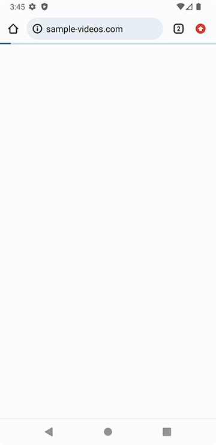
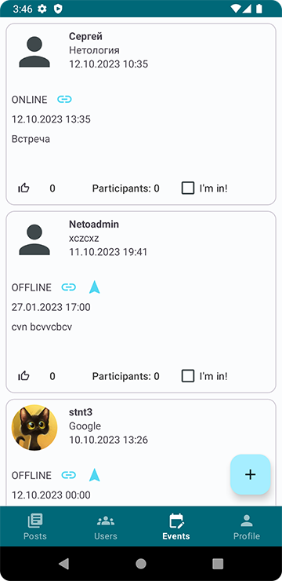
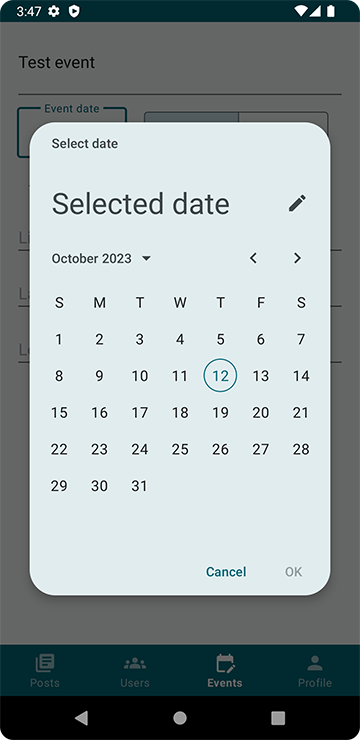

# Application "NeWork"
(Netology, profession "Android Developer")

An application in LinkedIn format in which users can create posts with media resources and geotags. The application displays the positions where the user worked, his social connections (in which posts he is marked, in which conferences he is a speaker or participant), thematic posts, check-ins at conferences, links to YouTube, etc.

Stack: Kotlin, XML, Room, Retrofit2, Coroutines, Dagger2/Hilt, Glide, GSON, Google Maps, Pager

### Screenshots:
  
  
  
  
  
  
  